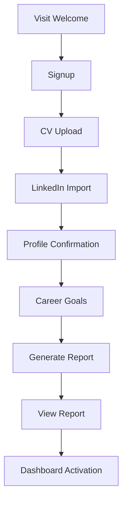

# Onboarding Funnel

## Purpose

The onboarding funnel gets a new user from curiosity to a useful Career Intelligence Report with the least friction possible.

## Funnel Steps



## Screen 1: Welcome

Goal:

- Explain the value and start signup.

Wireframe:

```text
[CareerOS AI]
Your AI career operating system.

[AI message]
[3 value bullets]
[Get started] [Log in]
```

AI says:

> I will analyze your CV, LinkedIn profile, and career goals to create your first Career Intelligence Report. You will see your strengths, gaps, job opportunities, and next best actions.

Primary CTA:

- Get started

Success metric:

- Welcome to signup conversion.

## Screen 2: Authentication

Goal:

- Create durable account.

Wireframe:

```text
[Create your account]
[Continue with Google]
[Email]
[Password]
[Create account]
```

AI says:

> Your career profile needs a secure account so I can remember your goals, applications, and recommendations.

Success metric:

- Signup completion.

## Screen 3: CV Upload

Goal:

- Capture highest-value career context quickly.

Wireframe:

```text
[Upload your CV]
[Drag and drop area]
[Upload button]
[Continue without CV]
[Privacy note]
```

AI says before upload:

> Upload your CV and I will extract your experience, skills, education, and career signals. You can edit anything I get wrong.

AI says after upload:

> I found your recent experience and key skills. Next, add LinkedIn context so I can compare how your public profile supports your CV.

Success metric:

- CV upload completion.

## Screen 4: LinkedIn Import

Goal:

- Add public professional positioning.

Wireframe:

```text
[Add LinkedIn context]
[LinkedIn URL input]
[Paste profile text box]
[How to copy profile text helper]
[Continue]
[Skip for now]
```

AI says:

> LinkedIn helps me understand how you present yourself publicly. If direct import is unavailable, paste your profile text here and I will still use it.

After import:

> I added your LinkedIn context. I will now show the profile details I plan to use for your analysis.

Success metric:

- LinkedIn import, paste, or explicit skip.

## Screen 5: Profile Confirmation

Goal:

- Let user correct inferred data.

Wireframe:

```text
[Confirm your profile]
[Name]
[Current title]
[Current company]
[Location]
[Skills tags]
[Experience summary]
[Save and continue]
```

AI says:

> Please review this carefully. I will treat your edits as more reliable than anything I inferred from your CV or LinkedIn profile.

Success metric:

- Profile confirmation completion.

## Screen 6: Career Goals

Goal:

- Focus the analysis.

Wireframe:

```text
[What are you aiming for?]
[Target role]
[Preferred locations]
[Remote preference]
[Industries]
[Timeline]
[Salary expectation optional]
[Generate my report]
```

AI says:

> Your goals decide how I judge readiness. A strong profile for one role may need different evidence for another.

Success metric:

- Goal form completion.

## Screen 7: Analysis Generation

Goal:

- Maintain trust during wait.

Wireframe:

```text
[Building your Career Intelligence Report]
Step 1: Reading CV
Step 2: Comparing LinkedIn profile
Step 3: Mapping skills
Step 4: Finding gaps
Step 5: Preparing recommendations
```

AI says:

> I am comparing your experience, skills, and goals. I will show you what I found, what looks strong, and what may be holding you back.

Success metric:

- Report generation completion.

## Screen 8: Report Reveal

Goal:

- Deliver wow moment.

AI says:

> I have your first report. The most important thing I noticed is this: [specific insight]. This is the fastest lever to improve your career readiness.

Success metric:

- User reaches dashboard or clicks next action.

## Drop-Off Recovery

- If no CV: allow manual profile path.
- If no LinkedIn: continue with CV and manual fields.
- If analysis fails: preserve inputs and allow retry.
- If user abandons before report: resume onboarding where they left off.

