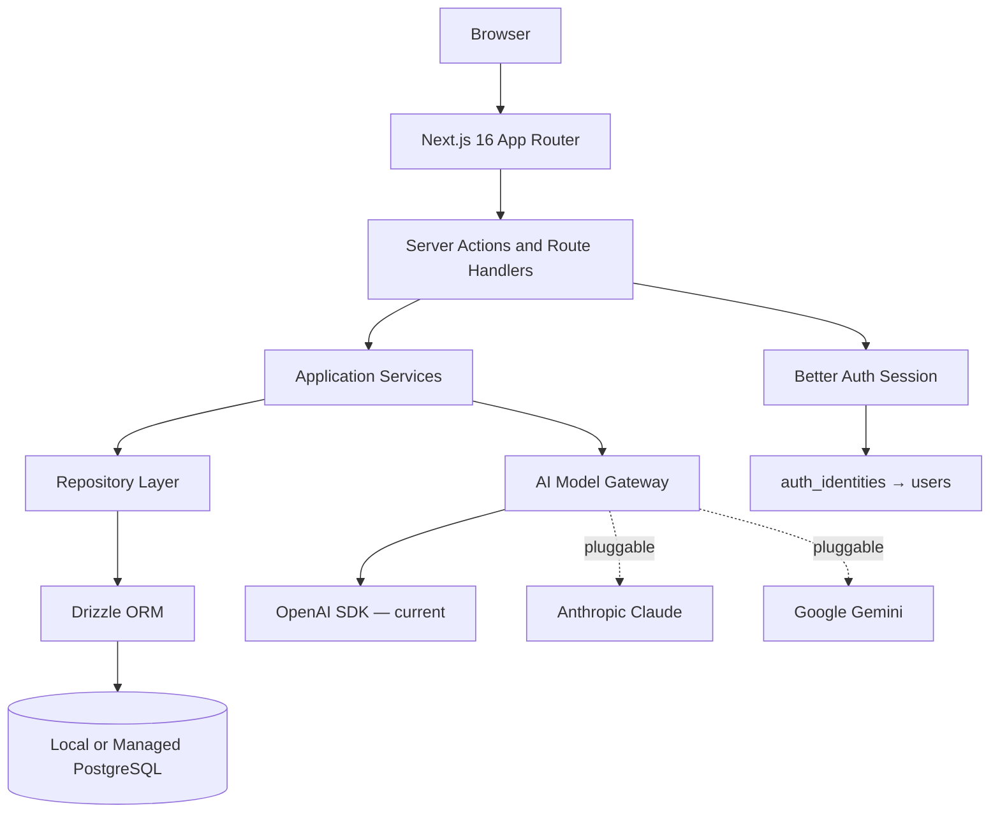

# PostgreSQL-First Architecture

## Status

Completed. CareerOS is a PostgreSQL-first product. Supabase has been removed as an application architecture dependency.

## Principles

- The database is standard PostgreSQL and runs locally, in managed cloud PostgreSQL, or behind a future service boundary.
- All migrations must run against vanilla PostgreSQL — no Supabase-specific functions.
- Application code never depends on PostgREST semantics, `auth.users`, `auth.uid()`, or Supabase-specific RLS functions.
- The ORM is Drizzle — type-safe, SQL-forward, migration-controlled.
- All user-owned data is accessed through repository interfaces scoped by CareerOS app `users.id`.

## Current Stack



## Data Access Principles

1. Route handlers and server actions call services, not database clients.
2. Services receive CareerOS app `userId` from the auth/session abstraction.
3. Repositories accept explicit `userId` filters for every user-owned read/write.
4. Database foreign keys and constraints protect ownership and integrity.
5. Application authorization must not depend solely on client-side checks.
6. Migrations are portable PostgreSQL and run against any vanilla Postgres instance.

## Repository Structure

```
packages/database/
  src/
    schema/index.ts      — Drizzle table definitions
    client.ts            — PostgreSQL connection client
    repositories/        — Domain repository implementations
  migrations/            — Committed Drizzle migrations
```

## Auth Identity Mapping

Better Auth owns credential and session management. CareerOS owns product identity.

```
Better Auth user.id → auth_identities.provider_subject
auth_identities.user_id → users.id (CareerOS app user)
Domain tables → always reference users.id
```

`apps/web/src/lib/auth/session.ts` resolves a Better Auth session into a CareerOS app user.

## Production Database Options

All production options must be PostgreSQL-compatible:

- **Neon**: strong fit for serverless PostgreSQL and branching workflows.
- **Supabase Postgres** (as managed PostgreSQL only, not as an auth/RLS dependency): acceptable.
- **AWS RDS or Aurora PostgreSQL**: stronger enterprise posture, more operations overhead.
- **Crunchy Bridge**: solid managed PostgreSQL option.
- **Railway or Fly managed PostgreSQL**: acceptable for early MVP.

Use local Docker PostgreSQL for development, then choose a managed provider for production once deployment constraints are clearer.

## RLS Position

PostgreSQL RLS may be used in the future but is not required for MVP. The preferred approach:

1. Enforce ownership in repositories and service methods (current approach).
2. Add database foreign keys and indexes.
3. Add portable PostgreSQL RLS later using transaction-local user context, if deployment model supports it.

Portable RLS pattern (not Supabase-specific):

```sql
SELECT set_config('app.current_user_id', $1, true);
```

Policies can then compare:

```sql
user_id::text = current_setting('app.current_user_id', true)
```

## Guardrails

- All migrations must run against vanilla PostgreSQL — no Supabase schema dependencies.
- No `@supabase/*` imports in active application code.
- No `auth.users` or `auth.uid()` references in domain migrations.
- All user-owned reads and writes must pass CareerOS app `userId` explicitly.
- Status fields should use Drizzle enum types or check constraints, not plain `text`.
