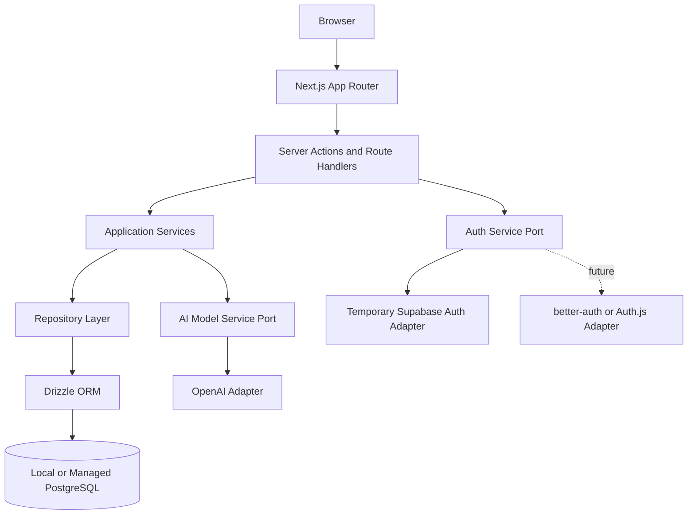
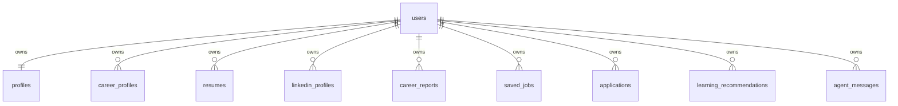

# PostgreSQL-First Architecture

## Purpose

CareerOS should be treated as a PostgreSQL-first product, not a Supabase-dependent product. Supabase can remain a useful implementation provider during the MVP, especially for authentication, but the application architecture should assume that the database is a standard PostgreSQL-compatible system that can run locally, in managed cloud Postgres, or behind a future service boundary.

This document defines the target database posture, the recommended stack, and the migration path from the current Supabase-heavy implementation.

## Current Supabase Usage Review

The current MVP uses Supabase in four major ways:

| Area                  | Current Usage                                                                                                     | Lock-In Risk                                                                                     | Migration Priority |
| --------------------- | ----------------------------------------------------------------------------------------------------------------- | ------------------------------------------------------------------------------------------------ | ------------------ |
| Authentication        | `@supabase/ssr`, Supabase Auth cookies, `auth.getClaims`, sign in, sign up, sign out, auth callback               | Medium-high because auth session format and helper APIs are provider-specific                    | Medium             |
| Database client       | Supabase JS `.from(...).select/insert/update` across onboarding, dashboard, report generation, and status checks  | High because application logic directly depends on PostgREST client semantics                    | High               |
| Schema and migrations | SQL files under `infrastructure/supabase/migrations`, references to `auth.users`, RLS policies using `auth.uid()` | High because local vanilla Postgres does not include Supabase auth schema/functions              | High               |
| Security model        | Row Level Security policies on every user-owned table                                                             | Medium because PostgreSQL supports RLS, but the current policies depend on Supabase auth context | Medium             |

Primary files currently coupled to Supabase:

- `apps/web/src/lib/supabase/server.ts`
- `apps/web/src/lib/supabase/browser.ts`
- `apps/web/src/lib/supabase/proxy.ts`
- `apps/web/src/lib/auth/session.ts`
- `apps/web/src/app/auth/actions.ts`
- `apps/web/src/app/auth/callback/route.ts`
- `apps/web/src/app/onboarding/actions.ts`
- `apps/web/src/lib/onboarding/status.ts`
- `apps/web/src/lib/career-report/data.ts`
- `apps/web/src/app/dashboard/actions.ts`
- `infrastructure/supabase/migrations/*.sql`

## Target Architecture

CareerOS should use PostgreSQL as the system of record and isolate provider-specific code behind application-owned interfaces.



The important boundary is this:

- UI and route handlers should not know whether data came from Supabase, Drizzle, Prisma, or a separate service.
- Application services should express business use cases.
- Repositories should own persistence details.
- Auth should expose a small app-owned session contract.

## Recommended Modern Database Stack

Recommended default:

- PostgreSQL 16 or 17 for local and production-compatible development.
- Docker Compose for local database, repeatable bootstrapping, and future service dependencies.
- Drizzle ORM for type-safe schema access and migrations.
- `node-postgres` or a serverless-compatible Postgres driver behind Drizzle, selected by hosting target.
- `drizzle-kit` for schema-driven migrations committed to the repo.
- SQL migration review in pull requests for production safety.
- Optional `pgvector` later, but not during the MVP unless explicitly needed.

Why Drizzle is the preferred default:

- Keeps SQL and relational modeling visible to engineers.
- Produces a small runtime footprint.
- Works naturally with a repository pattern.
- Fits Next.js server actions and future Node.js microservices.
- Avoids Prisma's heavier client generation/runtime and migration abstractions.
- Makes it easier to move SQL into dedicated services later.

Prisma remains a reasonable alternative if the team values:

- Faster onboarding for engineers familiar with Prisma schema syntax.
- Mature ecosystem conventions.
- Strong generated client ergonomics.
- Built-in migration workflow with broad team familiarity.

Decision recommendation:

Use Drizzle for CareerOS unless the first backend hire has a strong Prisma preference and will own the data layer. For a product that may split into services, Drizzle's SQL-forward model is the better long-term fit.

## Target Repo Layout

Proposed future structure:

```text
apps/
  web/
    src/
      app/
      components/
      server/
        actions/
        services/
        repositories/
        auth/
        db/
packages/
  database/
    src/
      schema/
      migrations/
      client.ts
      migrate.ts
  domain/
    src/
      career/
      users/
      reports/
      jobs/
  types/
  shared/
infrastructure/
  docker/
  postgres/
```

MVP can keep the current monorepo and introduce `packages/database` once code migration begins.

## Data Access Principles

1. Route handlers and server actions should call services, not database clients.
2. Services should receive `userId` from an auth/session abstraction.
3. Repositories should accept explicit `userId` filters for every user-owned read/write.
4. Database constraints should protect ownership and integrity.
5. Application authorization should not depend only on client-side checks.
6. PostgreSQL RLS may be used later, but the MVP should not require Supabase-specific `auth.uid()`.
7. Migrations must be runnable against vanilla PostgreSQL.

## MVP Data Model Adjustment

The current schema references `auth.users`, which exists in Supabase but not in vanilla Postgres. A PostgreSQL-first model should introduce an application-owned `users` table.



Recommended `users` contract:

| Column                            | Notes                                         |
| --------------------------------- | --------------------------------------------- |
| `id uuid primary key`             | CareerOS application user ID                  |
| `auth_provider text not null`     | `supabase`, `better_auth`, `authjs`, `custom` |
| `auth_subject text not null`      | Provider-specific external subject            |
| `email text not null`             | Normalized lowercase email                    |
| `email_verified_at timestamptz`   | Nullable                                      |
| `created_at timestamptz not null` | Default now                                   |
| `updated_at timestamptz not null` | Trigger or ORM-managed                        |

Add unique indexes:

- `(auth_provider, auth_subject)`
- `lower(email)` if email uniqueness is required for MVP

This avoids making every domain table depend on a provider-owned auth schema.

## Migration Strategy

### Phase 0: Documentation and Inventory

Status: this document set.

Actions:

- Document Supabase coupling.
- Freeze new direct Supabase data access.
- Require new persistence work to use a service/repository boundary.

### Phase 1: Introduce PostgreSQL-Compatible Schema

Actions:

- Create `packages/database`.
- Add Drizzle and `drizzle-kit`.
- Create vanilla PostgreSQL schema matching the current MVP tables.
- Replace `auth.users` references with `public.users`.
- Keep JSONB report fields for MVP flexibility.
- Add local Docker Compose Postgres.
- Add local migration commands.

No auth rewrite yet.

### Phase 2: Add Data Access Layer

Actions:

- Create repository interfaces for profiles, onboarding, reports, and sessions.
- Move Supabase `.from()` calls out of server actions.
- Implement repositories using Drizzle/Postgres.
- Keep Supabase Auth only for login/session.

Example repository surface:

```ts
export interface CareerProfileRepository {
  getLatestForUser(userId: string): Promise<CareerProfile | null>;
  upsertForUser(userId: string, input: CareerProfileInput): Promise<CareerProfile>;
}
```

### Phase 3: Bridge Supabase Auth to App Users

Actions:

- On sign-in/sign-up, resolve the provider identity into `users`.
- Store domain rows against `users.id`, not Supabase `auth.users.id`.
- Keep a mapping from Supabase subject to CareerOS user ID.
- Update `getCurrentAuthUser` to return the application user identity.

### Phase 4: Remove Supabase Database Client

Actions:

- Replace all Supabase JS data access with repository methods.
- Keep Supabase package only where auth still requires it.
- Move migrations out of `infrastructure/supabase/migrations` into `packages/database/migrations` or `infrastructure/postgres/migrations`.

### Phase 5: Reevaluate Auth Provider

Decision point:

- Keep Supabase Auth if it remains the fastest reliable path.
- Move to better-auth if the product needs first-party auth with strong TypeScript ergonomics.
- Move to Auth.js if OAuth breadth becomes more important than integrated credential management.
- Build custom auth only if regulatory, enterprise, or product constraints justify the maintenance cost.

## RLS Position

PostgreSQL RLS is useful, but CareerOS should not depend on Supabase-only RLS functions. The preferred sequence is:

1. Enforce ownership in repositories and service methods.
2. Add database foreign keys and indexes.
3. Add Postgres RLS later for high-risk tables if the deployment model can reliably set a transaction-local user context, such as `app.current_user_id`.

Future RLS pattern:

```sql
select set_config('app.current_user_id', $1, true);
```

Policies can then compare `user_id::text = current_setting('app.current_user_id', true)`.

This is portable PostgreSQL and can work outside Supabase.

## Implementation Order

| Order | Work                                               | Complexity  | Risk   |
| ----- | -------------------------------------------------- | ----------- | ------ |
| 1     | Add docs, freeze direct Supabase data access       | Low         | Low    |
| 2     | Add Docker Compose local Postgres                  | Low         | Low    |
| 3     | Add Drizzle schema/migrations                      | Medium      | Medium |
| 4     | Add `users` table and auth identity mapping        | Medium      | Medium |
| 5     | Introduce repositories for onboarding/report flows | Medium      | Medium |
| 6     | Switch reads/writes from Supabase JS to Drizzle    | Medium-high | Medium |
| 7     | Move migrations to Postgres-first location         | Medium      | Medium |
| 8     | Decide final auth provider                         | Medium-high | High   |

## Production Database Options

All production options must remain PostgreSQL-compatible:

- Neon: strong fit for serverless Postgres and branching workflows.
- Supabase Postgres only: acceptable if used as managed Postgres, not as an architectural dependency.
- AWS RDS or Aurora PostgreSQL: stronger enterprise posture, more operations.
- Crunchy Bridge: strong managed Postgres option.
- Railway/Fly managed Postgres: acceptable for early MVP, less ideal for regulated scale.

Recommendation:

Use local Docker Postgres for development, then choose Neon or Supabase Postgres for early production once deployment constraints are clearer. Keep the app portable by avoiding provider-specific database APIs.
