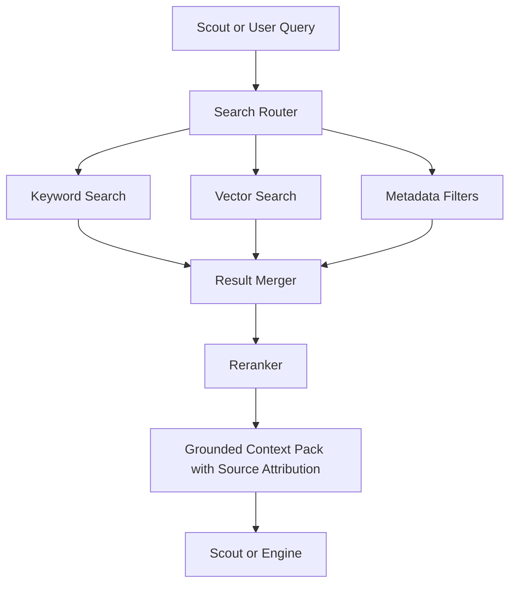

# RAG and Search Architecture

## Purpose

Retrieval-Augmented Generation and search provide grounded context for Scout's responses, career analysis, job matching, market summaries, and document generation.

RAG is not memory by itself. It is a retrieval mechanism used by Scout and the domain engines to ground outputs in user-specific and market-specific evidence.

Grounded retrieval is especially important for Scout's honest-mentor behavior: when Scout challenges a niche direction or validates a career path, it must cite sources and show the evidence basis.

## Search Domains

- User resumes and documents
- User memories and summaries
- Job opportunities
- Application assets
- Learning resources
- Market signals (grounded in trusted sources with dates)
- Career taxonomy
- Niche validation evidence
- Help and policy content

## Architecture

## Retrieval Requirements

- Tenant isolation
- User isolation
- Source attribution (every market claim must have a source)
- Freshness awareness (market data older than a defined threshold must be flagged)
- Permission filtering
- Chunk-level references
- Deduplication
- Relevance scoring

## Phase 1 MVP Version

- Use keyword search for structured records.
- Use basic text matching for job and learning recommendations.
- Apply strict user metadata filters.
- Build context packs with source IDs and snippets.
- Flag market signals with publication date and confidence.

## Phase 2 Version

- Add vector search for resumes, job descriptions, market summaries, and generated artifacts.
- Simple reranking by metadata and similarity score.

## Future Scale Version

At scale:

- Hybrid search across keyword, vector, graph, and recency.
- Dedicated reranking models.
- Query rewriting.
- Per-domain indexes.
- Multilingual retrieval.
- Regional data partitioning.

## Implementation Recommendations

- Store chunk references, not just embeddings.
- Keep embedding model versions for re-embedding when models change.
- Do not retrieve unapproved sensitive data into unrelated workflows.
- Use source-grounded outputs for all market and niche validation claims.
- Evaluate retrieval quality with golden test sets, especially for niche validation evidence.
- Freshness requirements: market data older than 90 days should be labeled as potentially outdated.

## Complexity

- Phase 1 complexity: Low-medium (keyword + metadata filters).
- Phase 2 complexity: Medium (vector search).
- Scale complexity: High.
- Main risks: wrong context retrieval, data leakage, stale market evidence, fabricated claims when retrieval returns nothing useful.

## Implementation Order

1. Define searchable domains.
2. Build chunking and metadata standards.
3. Add keyword search and metadata filters.
4. Add source attribution requirements to all market data.
5. Add vector indexing for documents (Phase 2).
6. Add hybrid result merging.
7. Add source-grounded context packs with freshness scoring.
8. Add reranking and multilingual retrieval later.
