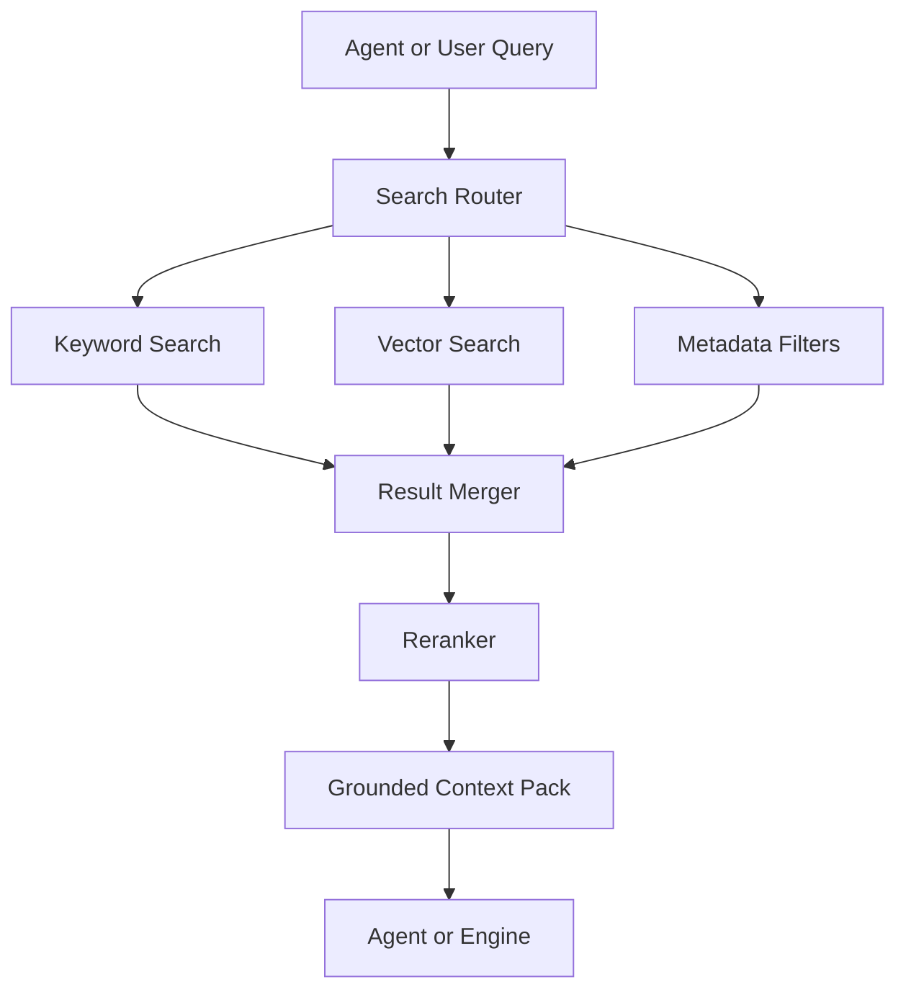

# RAG and Search Architecture

## Purpose

Retrieval-Augmented Generation and search provide grounded context for agent responses, career analysis, job matching, market summaries, and document generation.

RAG should not be treated as memory by itself. It is a retrieval mechanism used by the agent and engines.

## Search Domains

- User resumes and documents
- User memories and summaries
- Job opportunities
- Application assets
- Learning resources
- Market signals
- Career taxonomy
- Help and policy content

## Architecture

## Retrieval Requirements

- Tenant isolation
- User isolation
- Source attribution
- Freshness awareness
- Permission filtering
- Chunk-level references
- Deduplication
- Relevance scoring

## MVP Version

For MVP:

- Use keyword search for structured records.
- Use vector search for resumes, job descriptions, market summaries, and generated artifacts.
- Apply strict tenant and user metadata filters.
- Build context packs with source IDs and snippets.
- Add simple reranking by metadata and similarity score.

## Future Scale Version

At scale:

- Add hybrid search across keyword, vector, graph, and recency.
- Add dedicated reranking models.
- Add query rewriting.
- Add per-domain indexes.
- Add multilingual retrieval.
- Add regional data partitioning.

## Implementation Recommendations

- Store chunk references, not just embeddings.
- Keep embedding model versions.
- Re-embed content when models change.
- Do not retrieve unapproved sensitive data into unrelated workflows.
- Use source-grounded outputs for market and job claims.
- Evaluate retrieval quality with golden test sets.

## Tradeoffs and Alternatives

- Keyword search is precise but misses semantic matches.
- Vector search is flexible but can retrieve irrelevant context.
- Hybrid search is best for production but more complex.
- Graph retrieval improves explainability for career relationships.

## Complexity

- MVP complexity: Medium.
- Scale complexity: High.
- Main risks: wrong context retrieval, data leakage, stale embeddings, hallucinated unsupported claims.

## Implementation Order

1. Define searchable domains.
2. Build chunking and metadata standards.
3. Add vector indexing for documents.
4. Add hybrid result merging.
5. Add source-grounded context packs.
6. Add reranking and multilingual retrieval later.

