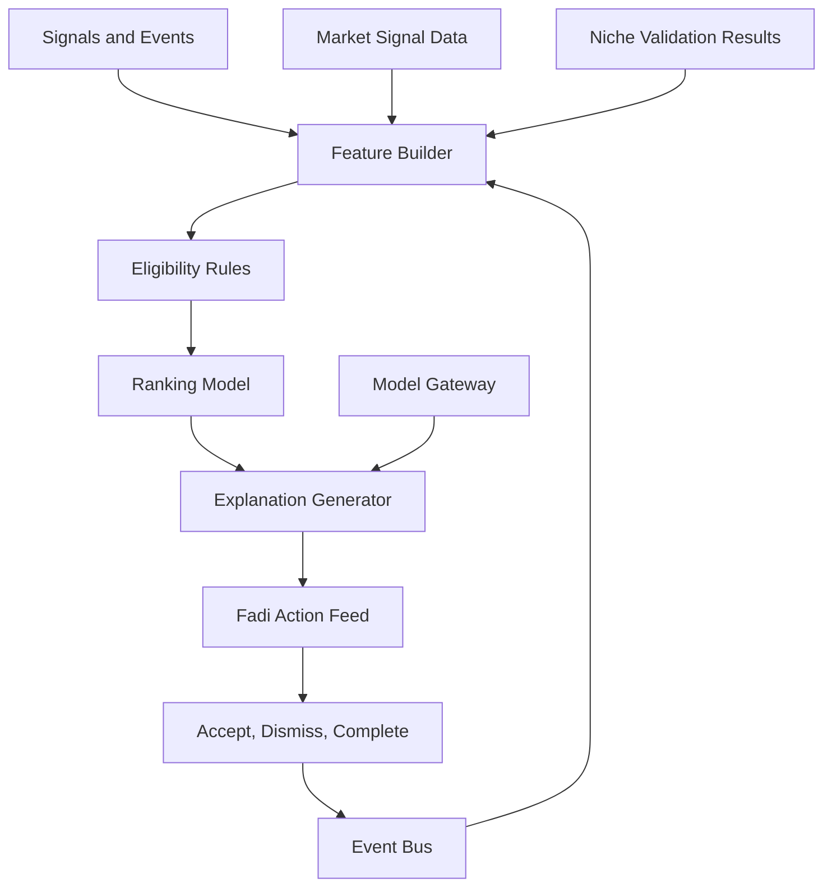

# Recommendation Engine

## Purpose

The Recommendation Engine decides what Fadi surfaces to the user next. It combines career analysis, niche validation outcomes, job matches, applications, learning gaps, market signals, motivation state, and user feedback into a prioritized action feed.

This engine drives the Fadi Command Center — the central operating surface of CareerOS.

## Recommendation Types

- Apply to opportunity
- Save or reject opportunity
- Tailor resume for a specific role
- Update profile or evidence
- Learn skill or build proof-of-work
- Prepare for interview
- Follow up on application
- Review market signal relevant to goals
- Adjust target role given market data
- Revisit niche validation if market conditions have changed
- Complete small motivational action

## Architecture

## Ranking Signals

- Expected career value
- Urgency
- User goal alignment
- Confidence in recommendation
- Required effort
- Deadline proximity
- Market relevance and freshness
- Niche alignment (validated direction)
- Past user feedback
- Risk level
- Subscription entitlement

## Phase 1 MVP Version

Rules-plus-scoring approach:

- Eligibility rules prevent irrelevant actions.
- Weighted ranking prioritizes high-value actions.
- Model gateway generates concise explanations from structured evidence.
- User feedback adjusts future recommendations.
- Niche validation outcomes feed into relevance filtering.

## Future Scale Version

At scale:

- Personalized ranking models.
- Contextual bandits for action feed optimization.
- Feature store for scoring.
- Segmentation by role, region, career stage, and behavior.
- Offline and online evaluation.
- Automatic niche revalidation triggered by market changes.

## Implementation Recommendations

- Keep eligibility rules deterministic.
- Store recommendation reasons and input signals.
- Avoid recommendation spam — rate limit recommendations per type.
- Make dismissals meaningful and learn from them.
- Separate recommendation creation from feed presentation.
- Define cooldown windows.
- Surface niche-relevant market changes as recommendations when they are material.

## Complexity

- Phase 1 complexity: Medium.
- Scale complexity: Very high.
- Main risks: irrelevant recommendations, user fatigue, opaque ranking, feedback loops.

## Implementation Order

1. Define recommendation schema.
2. Build event-derived signals (including niche validation outcomes and market signals).
3. Implement eligibility rules.
4. Add weighted ranker.
5. Add explanation generation through model gateway.
6. Add feedback loop.
7. Add ML ranking later.
