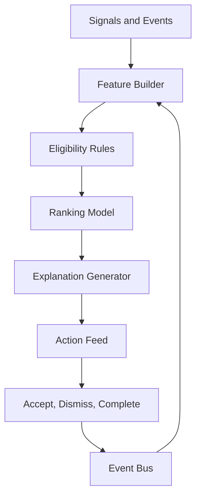

# Recommendation Engine

## Purpose

The Recommendation Engine decides what the user should see or do next. It combines career analysis, job matches, applications, learning gaps, market signals, motivation state, and user feedback into prioritized actions.

## Recommendation Types

- Apply to opportunity
- Save or reject opportunity
- Tailor resume
- Update profile
- Learn skill
- Prepare for interview
- Follow up on application
- Review market signal
- Adjust target role
- Complete small motivational action

## Architecture

## Ranking Signals

- Expected career value
- Urgency
- User goal alignment
- Confidence
- Required effort
- Deadline proximity
- Market relevance
- Past user feedback
- Risk level
- Subscription entitlement

## MVP Version

Use a rules-plus-scoring approach:

- Eligibility rules prevent irrelevant actions.
- Weighted ranking prioritizes high-value actions.
- LLM generates concise explanations from structured evidence.
- User feedback adjusts future recommendations.

## Future Scale Version

At scale:

- Add personalized ranking models.
- Add contextual bandits for action feed optimization.
- Use feature store for scoring.
- Segment by role, region, career stage, and behavior.
- Add offline and online evaluation.

## Implementation Recommendations

- Keep eligibility deterministic.
- Store recommendation reasons and input signals.
- Avoid recommendation spam.
- Make dismissals meaningful.
- Separate recommendation creation from feed presentation.
- Define cooldown windows.

## Tradeoffs and Alternatives

- Rule-based recommendations are explainable but can become complex.
- ML ranking improves personalization but needs strong data and guardrails.
- LLM-only recommendation is flexible but too opaque for core prioritization.
- Hybrid is preferred.

## Complexity

- MVP complexity: Medium.
- Scale complexity: Very high.
- Main risks: irrelevant recommendations, user fatigue, opaque ranking, feedback loops.

## Implementation Order

1. Define recommendation schema.
2. Build event-derived signals.
3. Implement eligibility rules.
4. Add weighted ranker.
5. Add explanation generation.
6. Add feedback loop.
7. Add ML ranking later.

