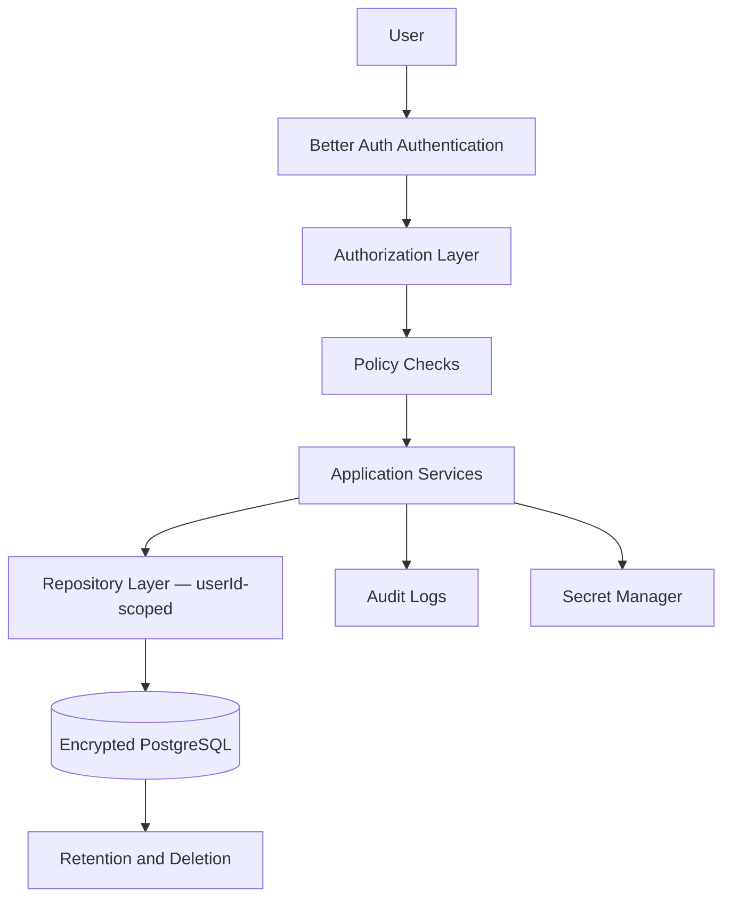

# Security and Compliance

## Purpose

CareerOS handles sensitive personal, career, employment, application, and market data. Security and compliance must be foundational, not an afterthought.

This document is implementation guidance, not legal advice. Formal compliance review is required before launch in regulated markets.

## Security Principles

- Least privilege.
- Tenant isolation.
- Encryption in transit and at rest.
- Explicit consent for integrations and AI processing.
- Approval-gated for all external actions.
- Auditability.
- Data minimization.
- Secure deletion.
- Privacy by design.
- Never log sensitive content: no resume text, LinkedIn text, raw prompts, provider tokens, or salary data in logs.

## Architecture

## Data Classification

- **Public**: public job posts and public company data.
- **Internal**: system metadata and non-sensitive operations data.
- **Sensitive personal**: profile, resume, salary expectations, career goals, applications.
- **Highly sensitive**: integration tokens, identity data, niche validation conversation content, documents shared externally.
- **AI processing context**: resume summaries, LinkedIn summaries, career analysis prompts — must never appear in logs or analytics.

## Authorization Model

Authorization relies on:

1. Better Auth session validated server-side via `getCurrentAuthUser()`.
2. Mapping to CareerOS app-owned `users.id` through `auth_identities`.
3. All repository and service calls scoped to that app user ID.
4. No client-supplied user IDs accepted for domain data access.

This is the primary enforcement point. PostgreSQL RLS can be added later for additional defense-in-depth.

## Phase 1 MVP Version

- Secure Better Auth session validation.
- User authorization via repository scoping.
- Encrypted storage (managed provider).
- Secure secret management (deployment platform secrets).
- Consent records for AI processing.
- Basic structured logging (no sensitive content).
- User data deletion plan.

## Future Scale Version

At scale:

- Regional compliance controls.
- Data residency.
- Advanced audit logs.
- Role-based access control for organization tenants.
- Security monitoring and anomaly detection.
- Penetration testing.
- SOC 2 readiness.
- DPIA and GDPR operational processes where applicable.
- Portable PostgreSQL RLS for high-risk tables.

## Implementation Recommendations

- Add authorization middleware before feature work expands.
- Encrypt integration tokens separately.
- Redact all sensitive data from logs.
- Do not send unnecessary personal data to AI providers — use summaries, not raw text.
- Build user export and deletion workflows.
- Track consent by provider and scope.
- Review all job source and profile source terms before integration.
- Validate that only the minimum provider metadata is stored in `auth_identities.provider_profile`.

## Complexity

- Phase 1 complexity: High.
- Scale complexity: Very high.
- Main risks: data leakage, weak consent, over-retention, unsafe third-party sharing, sensitive content in logs.

## Implementation Order

1. Define data classification.
2. Add authentication and authorization (done — Better Auth + repository scoping).
3. Add consent records for AI processing (done).
4. Add basic audit logs.
5. Add deletion/export workflows.
6. Add tenant isolation.
7. Add encryption and secret management at production providers.
8. Add formal compliance program before scale.
