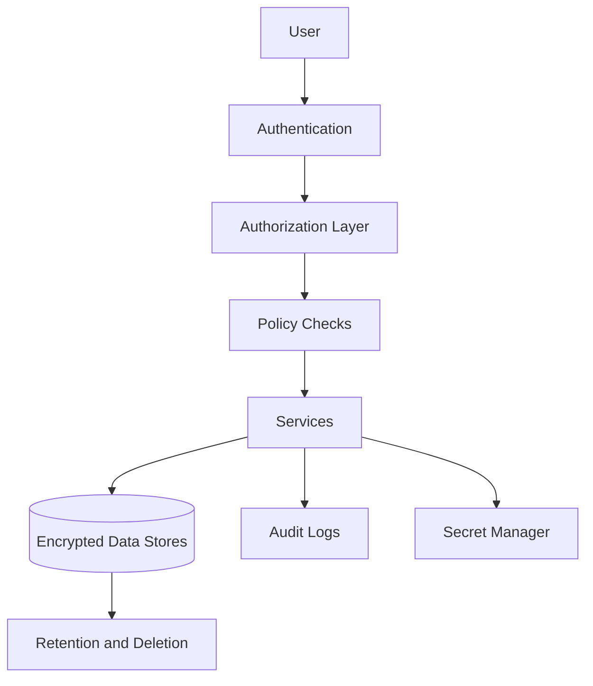

# Security and Compliance

## Purpose

CareerOS AI handles sensitive personal, career, employment, application, and possibly communication data. Security and compliance must be foundational, not an afterthought.

This document is implementation guidance, not legal advice. Formal compliance review is required before launch in regulated markets.

## Security Principles

- Least privilege
- Tenant isolation
- Encryption in transit and at rest
- Explicit consent for integrations
- Approval for external actions
- Auditability
- Data minimization
- Secure deletion
- Privacy by design

## Architecture

## Data Classification

- Public: public job posts and public company data.
- Internal: system metadata and non-sensitive operations data.
- Sensitive personal: profile, resume, salary expectations, goals, applications.
- Highly sensitive: integration tokens, identity data, messages, documents shared externally.

## MVP Version

For MVP:

- Secure authentication.
- Tenant and user authorization checks.
- Encrypted storage.
- Secure secret management.
- Consent records for integrations.
- Approval logs.
- Basic audit logs.
- User data deletion plan.

## Future Scale Version

At scale:

- Regional compliance controls.
- Data residency.
- Advanced audit logs.
- Role-based access control for organization tenants.
- Security monitoring.
- Penetration testing.
- SOC 2 readiness.
- DPIA and GDPR operational processes where applicable.

## Implementation Recommendations

- Add authorization middleware before feature work expands.
- Encrypt integration tokens separately.
- Redact sensitive data from logs.
- Do not send unnecessary personal data to AI providers.
- Build user export and deletion workflows.
- Track consent by provider and scope.
- Review job source and profile source terms.

## Tradeoffs and Alternatives

- Storing full interaction history improves support but increases privacy risk.
- Strict retention reduces risk but may limit personalization.
- Enterprise compliance can drive architecture discipline but adds overhead.
- Consumer-first speed must not bypass security foundations.

## Complexity

- MVP complexity: High.
- Scale complexity: Very high.
- Main risks: data leakage, weak consent, over-retention, unsafe third-party sharing.

## Implementation Order

1. Define data classification.
2. Add authentication and authorization.
3. Add tenant isolation.
4. Add encryption and secret management.
5. Add consent and approval records.
6. Add audit logs.
7. Add deletion/export workflows.
8. Add formal compliance program later.

