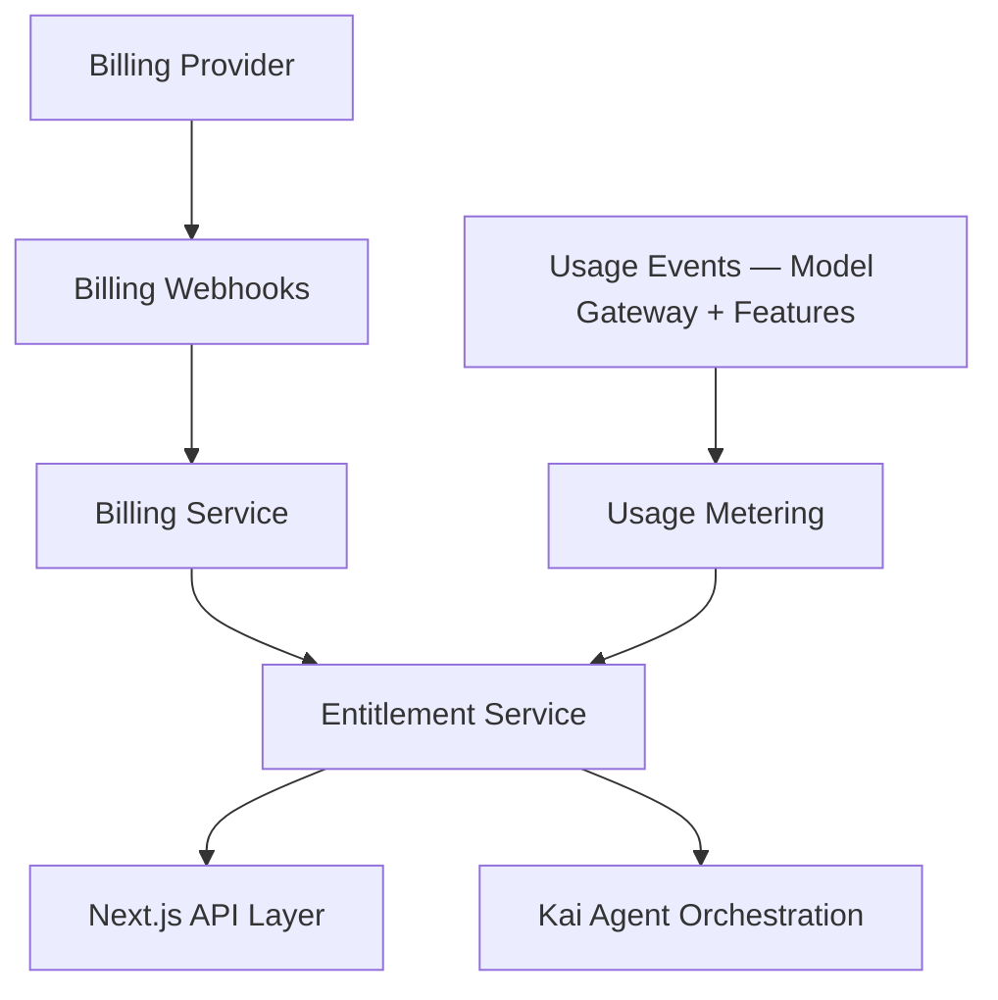

# Subscription and Monetization

## Purpose

CareerOS can monetize through subscriptions, premium automation, advanced intelligence, and future B2B programs. Monetization must align with user outcomes and trust. It must never exploit job search anxiety.

## Packaging Principles

- Free users receive meaningful career value — Kai's core identity must come through.
- Paid tiers unlock deeper analysis, more automation, and higher usage limits.
- Sensitive career advice must not be degraded into manipulative upsells.
- Pricing reflects AI gateway cost, integration cost, and value delivered.
- Voice is not a paywall feature — it is Phase 2 infrastructure.

## Candidate Tiers

### Free

- Basic profile setup and onboarding with Kai
- Initial career analysis and niche validation (directional)
- Limited opportunity matches
- Limited AI-generated drafts
- Basic application tracker

### Pro

- Expanded proactive job monitoring
- More tailored resume and cover letter generation
- Full learning plans and proof-of-work scaffolding
- Real-time market intelligence
- Application workflow assistance
- Higher AI usage limits
- Voice interaction (Phase 2)

### Premium

- Advanced career strategy and system prescription
- Higher-frequency proactive monitoring
- Interview preparation
- Salary intelligence
- Priority proactive discoveries
- More memory and document history
- Geo-political and economic context for niche validation

### Organization

- Tenant management
- Cohort analytics
- Program dashboards
- Admin controls
- Custom policies

## Architecture

## Phase 1 MVP Version

- Implement entitlement checks as internal configuration before paid billing.
- Track usage events for AI model gateway calls, generated assets, job matches, and monitored searches.
- Prepare billing integration boundaries.
- Launch monetization only after product value is validated with real users.

## Future Scale Version

At scale:

- Integrate subscription billing provider.
- Add plan-based rate limits.
- Add usage-based overage or fair-use controls.
- Add coupons, trials, and regional pricing.
- Add organization billing.

## Implementation Recommendations

- Keep billing, entitlements, and usage metering separate.
- Do not rely on client-side entitlement checks.
- Store billing webhook events idempotently.
- Design plan limits around costly operations (AI model gateway calls, background monitoring frequency).
- Add transparent usage messaging so users understand what they are consuming.
- Never gate Kai's honest-mentor behavior behind a paywall — the core assessment quality must be present on free.

## Complexity

- Phase 1 complexity: Low-medium.
- Scale complexity: High.
- Main risks: AI model gateway cost overruns, unfair pricing perception, entitlement bugs.

## Implementation Order

1. Define internal plans and entitlements.
2. Add usage events tied to model gateway calls.
3. Add entitlement checks in API and orchestration layers.
4. Add billing provider integration in Phase 2.
5. Add organization billing later.
