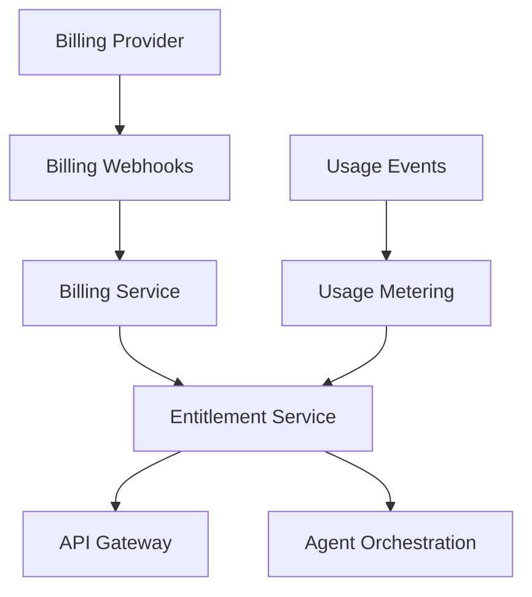

# Subscription and Monetization

## Purpose

CareerOS AI can monetize through subscriptions, premium automation, advanced intelligence, and future B2B programs. Monetization should align with user outcomes and trust, not exploit job search anxiety.

## Packaging Principles

- Free users should receive meaningful career value.
- Paid tiers should unlock deeper analysis, more automation, and higher usage.
- Sensitive career advice should not be degraded into manipulative upsells.
- Pricing should reflect AI cost, integration cost, and value delivered.

## Candidate Tiers

### Free

- Basic profile setup
- Initial career analysis
- Limited opportunity matches
- Limited AI drafts
- Basic application tracker

### Pro

- Expanded job monitoring
- More tailored resumes and cover letters
- Learning plans
- Market intelligence
- Application workflow assistance
- Higher AI usage limits

### Premium

- Advanced career strategy
- Higher-frequency monitoring
- Interview preparation
- Salary intelligence
- Priority automations
- More memory and document history

### Organization

- Tenant management
- Cohort analytics
- Program dashboards
- Admin controls
- Custom policies

## Architecture

## MVP Version

For MVP:

- Implement entitlement checks as internal configuration before paid billing.
- Track usage events for AI calls, generated assets, job matches, and monitored searches.
- Prepare billing integration boundaries.
- Launch monetization only after product value is validated.

## Future Scale Version

At scale:

- Integrate subscription billing.
- Add plan-based rate limits.
- Add usage-based overage or fair-use controls.
- Add coupons, trials, and regional pricing.
- Add organization billing.

## Implementation Recommendations

- Keep billing, entitlements, and usage metering separate.
- Do not rely on client-side entitlement checks.
- Store billing webhook events idempotently.
- Design plan limits around costly operations.
- Add transparent usage messaging.

## Tradeoffs and Alternatives

- Subscription pricing is predictable but may block unemployed users.
- Usage-based pricing maps to AI cost but feels less simple.
- Freemium improves acquisition but needs strict cost controls.
- B2B can be lucrative but shifts product priorities.

## Complexity

- MVP complexity: Low-medium.
- Scale complexity: High.
- Main risks: AI cost overruns, unfair pricing perception, entitlement bugs.

## Implementation Order

1. Define internal plans and entitlements.
2. Add usage events.
3. Add entitlement checks.
4. Add billing provider later.
5. Add organization billing later.

