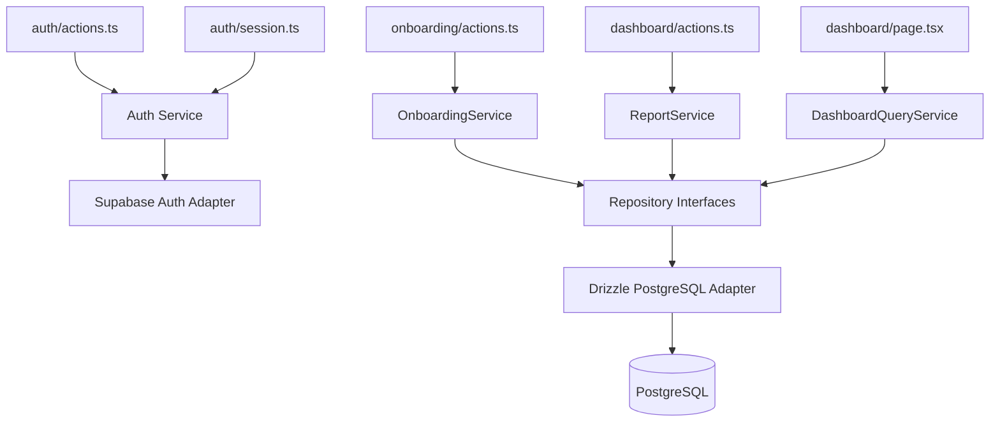
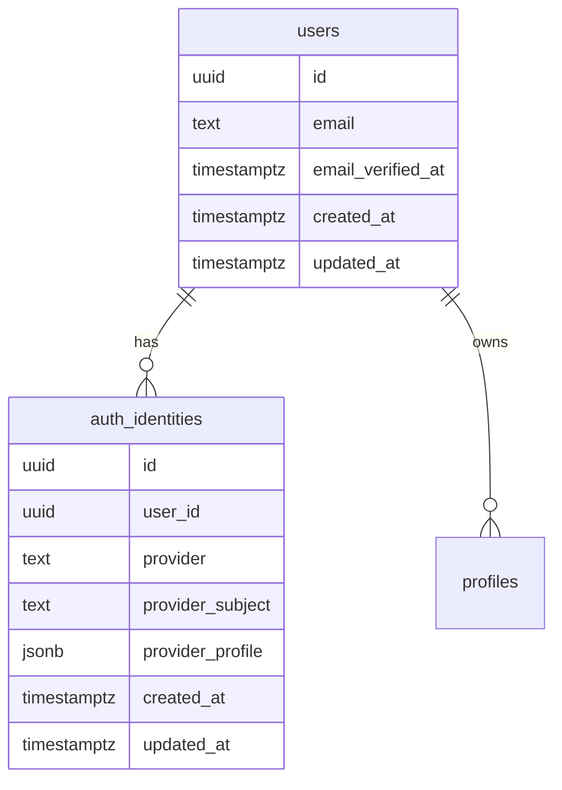

# Supabase Decoupling Plan

## Purpose

Supabase helped CareerOS reach a working MVP foundation quickly. The new direction is to make Supabase optional rather than foundational. This plan explains how to decouple without rewriting the app prematurely or breaking current authentication and onboarding flows.

## Decision Summary

Recommended path:

1. Keep Supabase Auth temporarily.
2. Stop adding new direct Supabase database access.
3. Introduce PostgreSQL-first schema and repositories.
4. Move domain tables away from `auth.users` and toward an application-owned `users` table.
5. Keep Supabase as an optional production provider only if it is used as standard managed Postgres and/or temporary auth.
6. Reevaluate auth after the MVP has real users.

Do not remove Supabase immediately. The current product is too early, and the highest-risk part of replacing Supabase Auth is user/session correctness, not code volume.

## What To Keep Temporarily

### Keep Supabase Auth Temporarily

Reasons:

- Auth is already implemented and validated.
- Email/password signup, sign-in, sign-out, callbacks, and protected routes work.
- Replacing auth now would delay product learning.
- The product has no enterprise auth requirements yet.

Constraints:

- Treat Supabase Auth as an adapter, not a domain model.
- Do not reference Supabase user IDs directly from new domain code after the decoupling begins.
- Add an application user mapping layer before replacing database access.

### Keep Supabase As Optional Production Provider

Supabase can remain a possible production database provider if used as PostgreSQL:

- Standard SQL.
- No dependency on PostgREST behavior.
- No dependency on Supabase-only RLS functions.
- No storage or edge-function dependency unless explicitly chosen later.

Supabase should not be the architecture. It can be one deployment option.

## What To Stop Doing

Stop adding:

- New `.from("table")` calls outside repository adapters.
- New migrations that require `auth.users` for domain table ownership.
- New RLS policies that require `auth.uid()` as the only authorization mechanism.
- Browser code that depends on Supabase data APIs.
- Business logic that handles Supabase response envelopes directly.

## Current Coupling Map

```mermaid
flowchart TD
    AuthActions[auth/actions.ts] --> SupabaseServer[createSupabaseServerClient]
    Callback[auth/callback/route.ts] --> SupabaseServer
    Session[auth/session.ts] --> SupabaseServer
    Proxy[proxy.ts] --> SupabaseProxy[lib/supabase/proxy.ts]

    Onboarding[onboarding/actions.ts] --> SupabaseServer
    Status[onboarding/status.ts] --> SupabaseServer
    ReportData[career-report/data.ts] --> SupabaseServer
    DashboardActions[dashboard/actions.ts] --> SupabaseServer

    SupabaseServer --> SupabaseSDK[@supabase/ssr and supabase-js]
    SupabaseSDK --> Supabase[(Supabase Auth and PostgREST)]
```

## Target Coupling Map



## Auth Options

### Option A: Keep Supabase Auth Temporarily

Recommendation: choose this for now.

Pros:

- Lowest immediate risk.
- Preserves existing user flows.
- Lets the team focus on database decoupling first.
- Supabase Auth can coexist with local Postgres if mapped through `auth_identities`.

Cons:

- Session logic remains provider-specific.
- Local development still needs Supabase Auth or a mock/dev auth path.
- Future migration still required if Supabase Auth becomes limiting.

### Option B: Replace With Auth.js

Pros:

- Popular Next.js ecosystem option.
- Strong OAuth provider coverage.
- Can store sessions/users in PostgreSQL.
- Reduces Supabase dependency.

Cons:

- Email/password support often requires more care than OAuth-first flows.
- Adds migration work before product validation.
- Session model and callbacks need careful design.

Best if:

- CareerOS prioritizes OAuth/social login breadth.
- The team wants a well-known framework with broad examples.

### Option C: Replace With better-auth

Pros:

- Modern TypeScript-first auth library.
- Good fit for first-party app-owned auth.
- Database-backed and framework-friendly.
- Can reduce provider lock-in cleanly.

Cons:

- Younger ecosystem than Auth.js.
- Requires team confidence in its long-term maintenance.
- Still a meaningful auth migration.

Best if:

- CareerOS wants first-party email/password, OAuth, organizations later, and app-owned auth tables.

### Option D: Custom Auth

Pros:

- Full control.
- No auth framework lock-in.

Cons:

- Highest security and maintenance burden.
- Slows product development.
- Easy to get edge cases wrong.

Recommendation:

Do not build custom auth for the MVP.

## Recommended Auth Path

| Timeframe                  | Recommendation                                                      |
| -------------------------- | ------------------------------------------------------------------- |
| Now                        | Keep Supabase Auth temporarily                                      |
| During Postgres migration  | Add `users` and `auth_identities` tables                            |
| After first 100 users      | Decide between Supabase Auth, better-auth, or Auth.js               |
| Before enterprise features | Revisit SSO, audit logs, organization accounts, and account linking |

## Proposed Identity Tables



This permits:

- Supabase Auth now.
- better-auth/Auth.js later.
- Multiple linked identities later.
- Stable CareerOS `users.id` across provider migrations.

## Database Decoupling Steps

### Step 1: Add Service and Repository Interfaces

No behavior change.

Initial interfaces:

- `AuthSessionService`
- `OnboardingService`
- `CareerReportService`
- `DashboardQueryService`
- `ProfileRepository`
- `CareerReportRepository`

### Step 2: Wrap Existing Supabase Data Access

Create Supabase-backed repository adapters first. This reduces blast radius before switching ORM.

Example:

```ts
export class SupabaseCareerReportRepository implements CareerReportRepository {
  async createForUser(userId: string, input: CreateCareerReportInput) {
    // Existing Supabase insert lives here temporarily.
  }
}
```

### Step 3: Add Drizzle/Postgres Adapter

Once the repository contract is stable, add a Drizzle implementation.

### Step 4: Move Call Sites

Move these call sites in order:

1. `getOnboardingStatus`
2. `getDashboardProfileSummary`
3. `getLatestCareerReport`
4. `completeOnboardingAction`
5. `generateCareerReportAction`

### Step 5: Replace Supabase SQL Migrations

Create vanilla PostgreSQL migrations:

- `users`
- `auth_identities`
- MVP domain tables
- indexes
- triggers
- optional portable RLS later

### Step 6: Remove Supabase Database Client Usage

After all data access goes through Drizzle repositories:

- Remove Supabase DB queries.
- Keep Supabase Auth only in the auth adapter.
- Remove database-related Supabase environment assumptions.

## Migration Risks

| Risk                         | Likelihood | Impact | Mitigation                                                    |
| ---------------------------- | ---------- | ------ | ------------------------------------------------------------- |
| User ID mismatch             | Medium     | High   | Introduce `users` mapping before moving domain tables         |
| Auth session regression      | Medium     | High   | Keep Supabase Auth until DB migration is stable               |
| Data loss during schema move | Low-medium | High   | Write explicit migration scripts and backup before production |
| Duplicate data access paths  | Medium     | Medium | Freeze new Supabase `.from()` calls                           |
| RLS behavior changes         | Medium     | Medium | Enforce ownership in repositories first                       |
| Slower MVP progress          | Medium     | Medium | Decouple incrementally, not as a rewrite                      |

## Definition Of Done

Supabase is decoupled when:

- No domain module imports `@supabase/*`.
- No server action directly calls `.from()`.
- Migrations run against plain local PostgreSQL.
- Domain tables reference `public.users`, not `auth.users`.
- Supabase-specific code is limited to `auth/adapters/supabase`.
- Production can choose Supabase Postgres, Neon, RDS, or another PostgreSQL-compatible provider without application rewrites.
