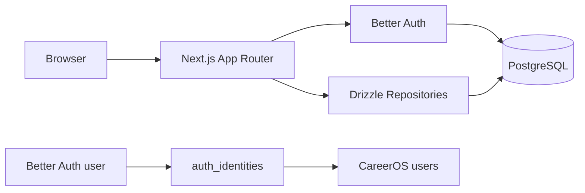

# Supabase Decoupling — Completed

## Status

Supabase has been fully removed from the active CareerOS application.

Supabase is no longer used for:

- Authentication
- Session handling
- Route protection
- Domain database access
- Environment configuration

## Active Stack (Post-Migration)



- **Authentication**: Better Auth with Drizzle adapter
- **Database**: Local PostgreSQL via Docker, production PostgreSQL provider TBD
- **ORM**: Drizzle ORM with committed migrations in `packages/database/migrations`
- **Data access**: Repository-backed domain data access

## What Was Removed

- `@supabase/ssr`
- `@supabase/supabase-js`
- Supabase server/browser/proxy client helpers
- Supabase auth callback route
- Supabase public and service-role environment variables
- `NEXT_PUBLIC_SUPABASE_URL` and `NEXT_PUBLIC_SUPABASE_ANON_KEY` from environment templates

## App User Mapping

Better Auth owns login credentials and sessions. CareerOS owns product identity.

| Field | Meaning |
| --- | --- |
| `auth_identities.provider` | `better_auth` |
| `auth_identities.provider_subject` | Better Auth `user.id` |
| `auth_identities.user_id` | CareerOS app-owned `users.id` |
| Domain table `user_id` | Always CareerOS app `users.id` |

`apps/web/src/lib/auth/session.ts` is the boundary that resolves an authenticated Better Auth user into an app-owned user.

## Remaining Legacy Assets

The folder below is historical reference only:

```text
infrastructure/supabase/
```

Do not use those migrations for active local development. The live schema path is:

```text
packages/database/src/schema/index.ts
packages/database/migrations/
```

## Guardrails

- Do not add new imports from `@supabase/*`.
- Do not add Supabase environment variables back to app templates.
- Do not link domain data to Better Auth `user.id` directly.
- Do not query PostgreSQL directly from React components.
- Keep user-owned data access behind repositories and server actions.
- If Supabase is ever reconsidered, treat it as a PostgreSQL hosting provider only — not as an application architecture dependency.

## Verification

Use these checks after future auth or database changes:

```bash
rg -n "@supabase|createSupabase|NEXT_PUBLIC_SUPABASE|SUPABASE_" apps packages .env.example
npm run lint
npm run typecheck
npm run build
npm run db:up
npm run db:migrate
```

Expected result: no active app/package Supabase references.
