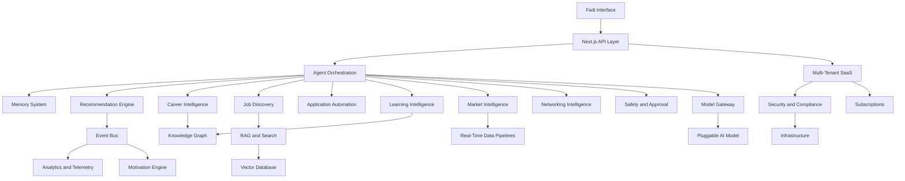

# CareerOS Technical Blueprint

## Purpose

This blueprint links the CareerOS architecture documents into one implementation-ready technical foundation. The system is designed as an Agentic AI Career Operating System built around Fadi — an AI that IS the entire product, not a widget inside it.

## Product Architecture North Star

CareerOS is not a chatbot, job board, or ATS. It is an AI operating layer — called Fadi — that observes, reasons, validates, recommends, and executes approved career workflows on behalf of users, proactively and around the clock.

Core architecture themes:

- **Fadi is the product**: every screen and workflow expresses Fadi's intelligence; there is no non-Fadi surface.
- **Pluggable AI core**: the model powering Fadi is a replaceable backend behind a model gateway abstraction; Claude, GPT, Gemini, local models, or future agents can be swapped in.
- **Real-time grounding**: market intelligence, job discovery, and niche validation must be grounded in current data from trusted third-party APIs — not static caches.
- **Agent orchestration as the control plane**: Fadi plans, tools, memory retrieval, and workflow execution are coordinated by an orchestration layer.
- **Event-driven workflows for proactive behavior**: profile changes, market signals, new jobs, and deadlines trigger Fadi actions without user intervention.
- **Persistent, inspectable memory**: Fadi remembers the user's career trajectory and adapts over time.
- **Domain engines**: career, jobs, applications, learning, market, networking, recommendations, and motivation are separable domains each owned by a dedicated engine.
- **Strict safety and approval controls**: all external actions are approval-gated; Fadi never acts externally without user consent.
- **Multi-tenant SaaS foundations**: designed to serve millions of users from day one in architecture, even while building for first 100 in implementation.
- **Voice as a core channel**: voice interaction (Browser Web Speech API) is Phase 2, not a future maybe.

## System Map

## Architecture Documents

### Foundation

- [PROJECT_INIT.md](PROJECT_INIT.md): product vision, Fadi identity, modules, and long-term maturity.
- [SYSTEM_ARCHITECTURE.md](SYSTEM_ARCHITECTURE.md): system architecture with pluggable AI core and real-time data layer.
- [AGENT_FRAMEWORK.md](AGENT_FRAMEWORK.md): agent modes, tools, memory, and approval rules.
- [DATABASE_SCHEMA.md](DATABASE_SCHEMA.md): conceptual data model.
- [API_INTEGRATIONS.md](API_INTEGRATIONS.md): integration landscape and constraints.
- [UI_UX_GUIDELINES.md](UI_UX_GUIDELINES.md): Fadi-first UX direction.
- [MVP_ROADMAP.md](MVP_ROADMAP.md): phased product roadmap.
- [AI_PERSONA_DESIGN.md](AI_PERSONA_DESIGN.md): Fadi persona, behavior, and guardrails.

### Implementation Architecture

- [AGENT_ORCHESTRATION_ARCHITECTURE.md](AGENT_ORCHESTRATION_ARCHITECTURE.md): agent control plane, planning, tools, task execution.
- [MEMORY_SYSTEM_ARCHITECTURE.md](MEMORY_SYSTEM_ARCHITECTURE.md): explicit, inferred, episodic, semantic, and operational memory.
- [CAREER_INTELLIGENCE_ENGINE.md](CAREER_INTELLIGENCE_ENGINE.md): profile analysis, niche validation, readiness, and career scoring.
- [JOB_DISCOVERY_ENGINE.md](JOB_DISCOVERY_ENGINE.md): proactive job ingestion, normalization, matching, and monitoring.
- [APPLICATION_AUTOMATION_ENGINE.md](APPLICATION_AUTOMATION_ENGINE.md): resume, cover letter, tracker, and interview workflow automation.
- [LEARNING_INTELLIGENCE_ENGINE.md](LEARNING_INTELLIGENCE_ENGINE.md): skill gap to learning plan and proof-of-work scaffolding.
- [MARKET_INTELLIGENCE_ENGINE.md](MARKET_INTELLIGENCE_ENGINE.md): real-time labor market, salary, hiring, layoff, and skill demand signals.
- [RECOMMENDATION_ENGINE.md](RECOMMENDATION_ENGINE.md): prioritized action feed and next-best-action system.
- [EVENT_DRIVEN_ARCHITECTURE.md](EVENT_DRIVEN_ARCHITECTURE.md): events, workers, outbox, and async workflow foundation.
- [AI_SAFETY_AND_APPROVAL_SYSTEM.md](AI_SAFETY_AND_APPROVAL_SYSTEM.md): risk levels, approval gates, and audit controls.
- [MULTI_TENANT_SAAS_ARCHITECTURE.md](MULTI_TENANT_SAAS_ARCHITECTURE.md): tenant model, isolation, entitlements, and global scale path.
- [SUBSCRIPTION_AND_MONETIZATION.md](SUBSCRIPTION_AND_MONETIZATION.md): plans, billing, entitlements, usage metering.
- [ANALYTICS_AND_TELEMETRY.md](ANALYTICS_AND_TELEMETRY.md): product, agent, quality, cost, and operational telemetry.
- [GAMIFICATION_AND_MOTIVATION_ENGINE.md](GAMIFICATION_AND_MOTIVATION_ENGINE.md): progress, confidence, streaks, and momentum.
- [KNOWLEDGE_GRAPH_ARCHITECTURE.md](KNOWLEDGE_GRAPH_ARCHITECTURE.md): role, skill, company, credential, learning, and career relationship model.
- [RAG_AND_SEARCH_ARCHITECTURE.md](RAG_AND_SEARCH_ARCHITECTURE.md): grounded retrieval and hybrid search.
- [VECTOR_DATABASE_STRATEGY.md](VECTOR_DATABASE_STRATEGY.md): vector indexing, metadata, isolation, and scaling strategy.
- [DATA_PIPELINE_ARCHITECTURE.md](DATA_PIPELINE_ARCHITECTURE.md): ingestion, transformation, indexing, embeddings, analytics, and features.
- [INFRASTRUCTURE_AND_DEPLOYMENT.md](INFRASTRUCTURE_AND_DEPLOYMENT.md): hosting, services, queues, storage, observability, and deployment.
- [SECURITY_AND_COMPLIANCE.md](SECURITY_AND_COMPLIANCE.md): privacy, consent, auditability, authorization, and compliance foundations.

## Current Technical Stack

| Layer | Technology |
| --- | --- |
| Frontend framework | Next.js 16, React 19, TypeScript |
| Styling | Tailwind v4, shadcn/ui |
| Authentication | Better Auth with Drizzle adapter |
| Database | PostgreSQL (Docker local, production TBD) |
| ORM | Drizzle ORM with committed migrations |
| AI model | Pluggable — currently OpenAI SDK via model gateway |
| Voice | Browser Web Speech API (Phase 2) |
| Monorepo | npm workspaces |
| Real-time data | Trusted third-party APIs (Phase 3+) |

## MVP Implementation Order

1. Authentication and core data model (Better Auth, PostgreSQL, Drizzle).
2. Profile onboarding (resume, LinkedIn, manual fields).
3. Career Intelligence Engine: initial niche discovery and profile analysis.
4. Memory System for profile facts and preferences.
5. Agent Orchestration MVP with synchronous workflows.
6. Event table, outbox, and background workers foundation.
7. Recommendation Engine MVP: rules-based action feed.
8. Job Discovery MVP with one compliant job source.
9. Application Automation MVP: resume tailoring and cover letters.
10. AI Safety and Approval System.
11. Learning Intelligence MVP and proof-of-work scaffolding.
12. Analytics and telemetry.
13. RAG, search, and vector retrieval.
14. Market Intelligence MVP with real-time data sources.
15. Motivation Engine MVP.
16. Voice interaction (Phase 2, Browser Web Speech API).
17. Subscription entitlements and monetization.
18. Scale infrastructure, data pipelines, graph, and multi-region readiness.

## Complexity Overview

| Area | MVP Complexity | Scale Complexity |
| --- | --- | --- |
| Agent orchestration | High | Very high |
| Memory system | Medium-high | Very high |
| Career intelligence + niche validation | Medium | High |
| Job discovery (proactive, real-time) | Medium-high | Very high |
| Application automation | Medium | High |
| Learning intelligence | Medium | High |
| Market intelligence (real-time) | Medium | High |
| Recommendation engine | Medium | Very high |
| Event architecture | Medium | High |
| Safety and approvals | Medium | High |
| Model gateway (pluggable AI) | Medium | High |
| Multi-tenant SaaS | Medium | High |
| Security and compliance | High | Very high |
| Data pipelines (real-time) | Medium | Very high |
| Infrastructure | Medium | Very high |
| Voice (Phase 2) | Medium | Medium |

## MVP Architectural Shape

- Modular monolith backend (Next.js API routes and server actions).
- Shared PostgreSQL database (local Docker, production TBD) with user-scoped tables.
- Durable background queue for async tasks.
- Append-only event table with outbox pattern.
- Object storage for documents and files.
- Database-native vector extension or lightweight managed vector search.
- Model gateway abstraction with one current provider (OpenAI).
- Hard-coded policy evaluator for approvals.
- Rules-based recommendation ranker.
- Curated role and skill taxonomy.

## Future Scale Shape

At millions of users:

- Dedicated orchestration, ingestion, recommendation, search, and analytics services.
- Regional data partitions.
- Managed event streaming.
- Dedicated vector indexes by domain and region.
- Knowledge graph and feature store.
- Model gateway with routing across Claude, GPT, Gemini, and local models — with cost controls, fallbacks, and evaluation.
- Enterprise tenant isolation options.
- Advanced privacy, compliance, audit, and data residency controls.

## Non-Negotiable Guardrails

- No external submissions without explicit user approval.
- No invented job data, salary facts, market trends, or credentials.
- No hard-coded model provider assumptions in feature or engine design.
- No static market intelligence presented as current.
- No memory leakage across users or tenants.
- No sensitive data in analytics payloads.
- No unreviewed scraping strategy.
- No opaque scores without explanation.
