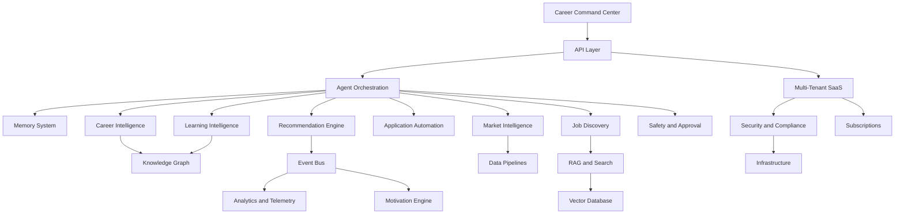

# CareerOS AI Technical Blueprint

## Purpose

This blueprint links the CareerOS AI architecture documents into one implementation-ready technical foundation. The system is designed as an Agentic AI Career Operating System for global users, with a path from MVP to millions of users.

## Product Architecture North Star

CareerOS AI is not a chatbot, job board, or ATS. It is an AI operating layer that observes, reasons, recommends, and executes approved career workflows on behalf of users.

Core architecture themes:

- Agent orchestration as the control plane.
- Event-driven workflows for proactive behavior.
- Persistent, inspectable memory.
- Domain engines for career, jobs, applications, learning, market, recommendations, and motivation.
- Strict safety and approval controls.
- Multi-tenant SaaS foundations from day one.
- Search, RAG, vector retrieval, and knowledge graph support for grounded intelligence.

## System Map

## Architecture Documents

### Foundation

- [PROJECT_INIT.md](PROJECT_INIT.md): product vision, onboarding, modules, and long-term maturity.
- [SYSTEM_ARCHITECTURE.md](SYSTEM_ARCHITECTURE.md): conceptual system architecture.
- [AGENT_FRAMEWORK.md](AGENT_FRAMEWORK.md): base agent modes, tools, memory, and approval rules.
- [DATABASE_SCHEMA.md](DATABASE_SCHEMA.md): initial conceptual data model.
- [API_INTEGRATIONS.md](API_INTEGRATIONS.md): integration landscape and constraints.
- [UI_UX_GUIDELINES.md](UI_UX_GUIDELINES.md): agent-first UX direction.
- [MVP_ROADMAP.md](MVP_ROADMAP.md): phased product roadmap.
- [AI_PERSONA_DESIGN.md](AI_PERSONA_DESIGN.md): AI persona behavior and guardrails.

### Implementation Architecture

- [AGENT_ORCHESTRATION_ARCHITECTURE.md](AGENT_ORCHESTRATION_ARCHITECTURE.md): agent control plane, planning, tools, task execution.
- [MEMORY_SYSTEM_ARCHITECTURE.md](MEMORY_SYSTEM_ARCHITECTURE.md): explicit, inferred, episodic, semantic, and operational memory.
- [CAREER_INTELLIGENCE_ENGINE.md](CAREER_INTELLIGENCE_ENGINE.md): profile analysis, readiness, and career scoring.
- [JOB_DISCOVERY_ENGINE.md](JOB_DISCOVERY_ENGINE.md): job ingestion, normalization, matching, and monitoring.
- [APPLICATION_AUTOMATION_ENGINE.md](APPLICATION_AUTOMATION_ENGINE.md): resume, cover letter, tracker, and interview workflow automation.
- [LEARNING_INTELLIGENCE_ENGINE.md](LEARNING_INTELLIGENCE_ENGINE.md): skill gap to learning plan workflows.
- [MARKET_INTELLIGENCE_ENGINE.md](MARKET_INTELLIGENCE_ENGINE.md): labor market, salary, hiring, layoff, and skill demand signals.
- [RECOMMENDATION_ENGINE.md](RECOMMENDATION_ENGINE.md): prioritized action feed and next-best-action system.
- [EVENT_DRIVEN_ARCHITECTURE.md](EVENT_DRIVEN_ARCHITECTURE.md): events, workers, outbox, and async workflow foundation.
- [AI_SAFETY_AND_APPROVAL_SYSTEM.md](AI_SAFETY_AND_APPROVAL_SYSTEM.md): risk levels, approval gates, and audit controls.
- [MULTI_TENANT_SAAS_ARCHITECTURE.md](MULTI_TENANT_SAAS_ARCHITECTURE.md): tenant model, isolation, entitlements, and global scale path.
- [SUBSCRIPTION_AND_MONETIZATION.md](SUBSCRIPTION_AND_MONETIZATION.md): plans, billing, entitlements, usage metering.
- [ANALYTICS_AND_TELEMETRY.md](ANALYTICS_AND_TELEMETRY.md): product, agent, quality, cost, and operational telemetry.
- [GAMIFICATION_AND_MOTIVATION_ENGINE.md](GAMIFICATION_AND_MOTIVATION_ENGINE.md): progress, confidence, streaks, and momentum.
- [KNOWLEDGE_GRAPH_ARCHITECTURE.md](KNOWLEDGE_GRAPH_ARCHITECTURE.md): role, skill, company, credential, learning, and career relationship model.
- [RAG_AND_SEARCH_ARCHITECTURE.md](RAG_AND_SEARCH_ARCHITECTURE.md): grounded retrieval and hybrid search.
- [VECTOR_DATABASE_STRATEGY.md](VECTOR_DATABASE_STRATEGY.md): vector indexing, metadata, isolation, and scaling strategy.
- [DATA_PIPELINE_ARCHITECTURE.md](DATA_PIPELINE_ARCHITECTURE.md): ingestion, transformation, indexing, embeddings, analytics, and features.
- [INFRASTRUCTURE_AND_DEPLOYMENT.md](INFRASTRUCTURE_AND_DEPLOYMENT.md): hosting, services, queues, storage, observability, and deployment.
- [SECURITY_AND_COMPLIANCE.md](SECURITY_AND_COMPLIANCE.md): privacy, consent, auditability, authorization, and compliance foundations.

## Recommended MVP Implementation Order

1. Security, tenancy, and core data model.
2. Authentication and profile onboarding.
3. Career Intelligence Engine.
4. Memory System.
5. Agent Orchestration MVP.
6. Event table, outbox, and background workers.
7. Recommendation Engine MVP.
8. Job Discovery MVP with one compliant source.
9. Application Automation MVP.
10. AI Safety and Approval System.
11. Learning Intelligence MVP.
12. Analytics and telemetry.
13. RAG/search and vector retrieval.
14. Market Intelligence MVP.
15. Motivation Engine MVP.
16. Subscription entitlements and monetization.
17. Scale infrastructure, data pipelines, graph, and multi-region readiness.

## Complexity Overview

| Area | MVP Complexity | Scale Complexity |
| --- | --- | --- |
| Agent orchestration | High | Very high |
| Memory system | Medium-high | Very high |
| Career intelligence | Medium | High |
| Job discovery | Medium-high | Very high |
| Application automation | Medium | High |
| Learning intelligence | Medium | High |
| Market intelligence | Medium | High |
| Recommendation engine | Medium | Very high |
| Event architecture | Medium | High |
| Safety and approvals | Medium | High |
| Multi-tenant SaaS | Medium | High |
| Security and compliance | High | Very high |
| Data pipelines | Medium | Very high |
| Infrastructure | Medium | Very high |

## MVP Architectural Shape

Recommended MVP shape:

- Modular monolith backend.
- Shared relational database with tenant-scoped tables.
- Durable background queue.
- Append-only event table with outbox pattern.
- Managed object storage.
- Managed vector search or database-native vector extension.
- One model provider behind a model gateway abstraction.
- Hard-coded policy evaluator for approvals.
- Rule-based recommendation ranker.
- Curated role and skill taxonomy.

This keeps the product buildable while preserving future scale boundaries.

## Future Scale Shape

At millions of users:

- Dedicated orchestration, ingestion, recommendation, search, and analytics services.
- Regional data partitions.
- Managed event streaming.
- Dedicated vector indexes by domain and region.
- Knowledge graph and feature store.
- Model gateway with routing, cost controls, fallbacks, and evaluation.
- Enterprise tenant isolation options.
- Advanced privacy, compliance, audit, and data residency controls.

## Key Engineering Decisions Still Required

- Frontend framework.
- Backend framework.
- Cloud provider.
- Database technology.
- Vector database approach.
- Search technology.
- Identity provider.
- Billing provider.
- Event bus and queue technology.
- LLM provider and model routing strategy.
- Workflow engine versus custom queue.
- Observability stack.

## Non-Negotiable Guardrails

- No external submissions without explicit user approval.
- No invented job, salary, credential, or experience claims.
- No memory leakage across users or tenants.
- No sensitive data in analytics payloads.
- No unreviewed scraping strategy.
- No opaque scores without explanation.
- No chatbot-only product architecture.

