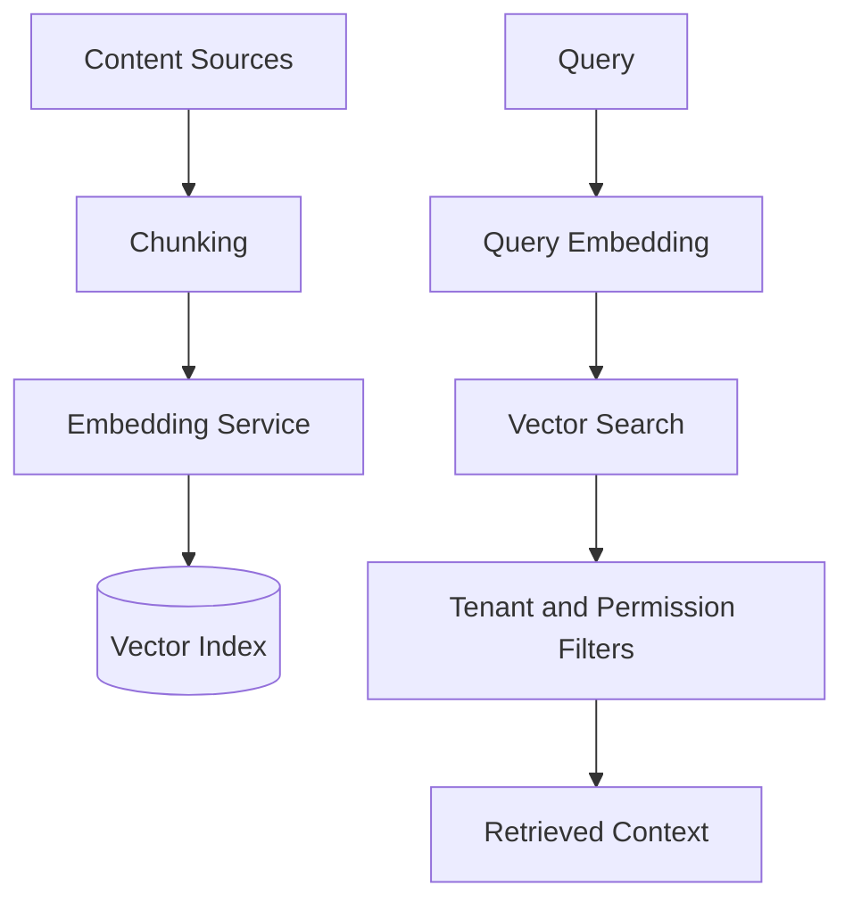

# Vector Database Strategy

## Purpose

The vector database stores embeddings for semantic retrieval across resumes, jobs, learning resources, market signals, application assets, and memory summaries.

It should support high-quality retrieval while enforcing tenant isolation and lifecycle management.

## Vectorized Content

- Resume chunks
- Profile summaries
- Job descriptions
- Application assets
- Career analysis summaries
- Memory summaries
- Learning resources
- Market signal summaries
- Role and skill descriptions

## Architecture

## Metadata Requirements

Every vector record should include:

- tenant_id
- user_id where applicable
- content_type
- source_entity_id
- source_version
- visibility
- region
- language
- created_at
- expires_at where applicable
- embedding_model_version

## MVP Version

For MVP:

- Use a managed vector database or database-native vector extension.
- Keep one index with strong metadata filters.
- Embed core documents and job descriptions.
- Store source text separately in the primary data store.
- Use small, consistent chunk sizes by domain.

## Future Scale Version

At scale:

- Split indexes by domain and region.
- Add hot and cold vector storage.
- Add batch re-embedding pipelines.
- Add approximate nearest neighbor tuning.
- Add multilingual embeddings.
- Add dedicated indexes for enterprise tenants where needed.

## Implementation Recommendations

- Do not rely on vector DB as source of truth.
- Use metadata filters before or during retrieval.
- Track embedding model versions.
- Support deletion and re-indexing.
- Build quality tests for retrieval.
- Encrypt sensitive source content outside vector metadata.

## Tradeoffs and Alternatives

- Database-native vectors reduce infrastructure but may hit scaling limits.
- Dedicated vector databases scale better but add vendor and operational complexity.
- Single index is simpler but harder to optimize.
- Domain-specific indexes improve relevance but add routing complexity.

## Complexity

- MVP complexity: Medium.
- Scale complexity: High.
- Main risks: tenant leakage, stale embeddings, cost growth, poor retrieval quality.

## Implementation Order

1. Choose MVP vector storage.
2. Define chunk and metadata schema.
3. Embed resumes and job descriptions.
4. Add retrieval evaluation.
5. Add domain indexes and re-embedding pipelines later.

