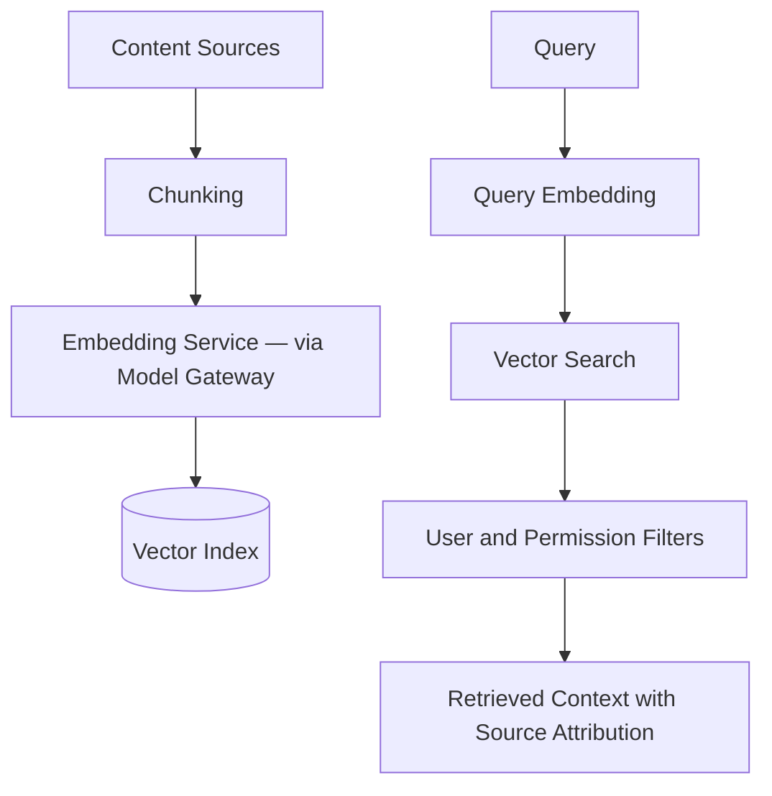

# Vector Database Strategy

## Purpose

The vector database stores embeddings for semantic retrieval across resumes, jobs, learning resources, market signals, application assets, and memory summaries. It supports Kai's ability to retrieve relevant career context at inference time, including evidence for niche validation and market intelligence.

It should support high-quality retrieval while enforcing user isolation and lifecycle management.

## Vectorized Content

- Resume chunks
- Profile summaries
- Job descriptions
- Application assets
- Career analysis summaries
- Memory summaries
- Learning resources
- Market signal summaries
- Role and skill descriptions
- Niche validation evidence

## Architecture

## Embedding via Model Gateway

Embedding calls route through the model gateway abstraction — the same abstraction used for text generation. This ensures the embedding model can be swapped (e.g., OpenAI ada vs Anthropic embeddings vs local models) without changing downstream retrieval code.

## Metadata Requirements

Every vector record should include:

- user_id
- content_type
- source_entity_id
- source_version
- visibility
- region
- language
- created_at
- expires_at (where applicable)
- embedding_model_version
- source_publication_date (for market signals)
- freshness_score (for market and niche evidence)

## Phase 1 MVP Version

Phase 1 does not require vector search. Keyword search and metadata filters are sufficient for the Phase 1 job and learning recommendation use cases.

## Phase 2 Version

- Add managed vector database or database-native vector extension (PostgreSQL `pgvector`).
- One index with strong metadata filters.
- Embed core documents and job descriptions.
- Store source text separately in the primary data store.
- Use small, consistent chunk sizes by domain.

## Future Scale Version

At scale:

- Split indexes by domain and region.
- Hot and cold vector storage.
- Batch re-embedding pipelines when models change.
- Approximate nearest neighbor tuning.
- Multilingual embeddings.
- Dedicated indexes for enterprise tenants where needed.
- Freshness-weighted retrieval for market intelligence.

## Implementation Recommendations

- Do not rely on vector DB as source of truth.
- Use metadata filters before or during retrieval.
- Track embedding model versions.
- Support deletion and re-indexing.
- Build quality tests for retrieval.
- Encrypt sensitive source content outside vector metadata.
- Tag market signal embeddings with source date and confidence.

## Complexity

- Phase 2 complexity: Medium.
- Scale complexity: High.
- Main risks: tenant leakage, stale embeddings, cost growth, poor retrieval quality, market evidence out of date.

## Implementation Order

1. Skip vector search in Phase 1.
2. Choose Phase 2 vector storage (PostgreSQL `pgvector` first for simplicity).
3. Define chunk and metadata schema.
4. Embed resumes and job descriptions.
5. Add retrieval evaluation.
6. Add domain indexes and re-embedding pipelines later.
